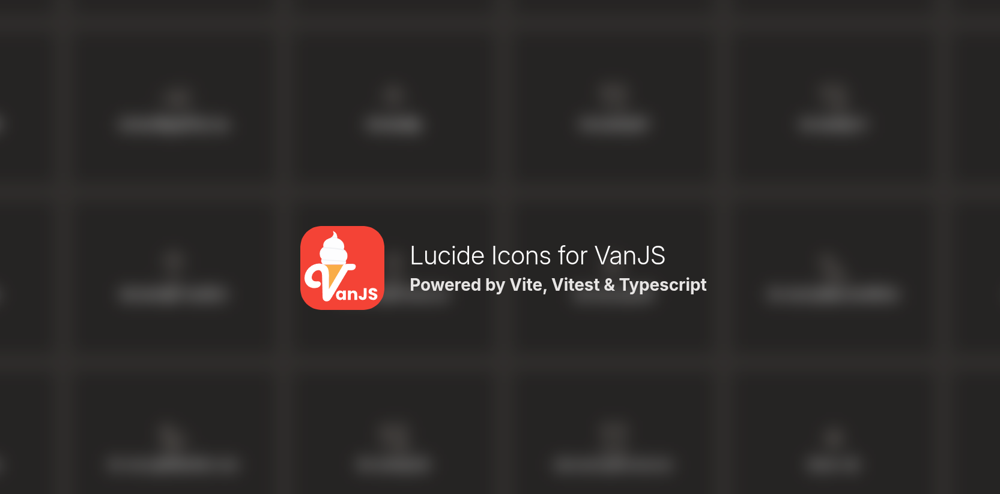

# vanjs-lucide

[](https://coveralls.io/github/thednp/vanjs-lucide)
[](https://github.com/thednp/vanjs-lucide/actions/workflows/ci.yml)
[](https://www.npmjs.com/package/vanjs-lucide)
[](https://www.typescriptlang.org/)
[](https://www.vitest.dev/)
[](https://vitejs.dev/)

[](https://thednp.github.io/vanjs-lucide)


Lucide icons for [VanJS](https://vanjs.org).

Powered by:

- [Vite](https://vitejs.dev) for tooling
- [Vite-Plugin-VanJS](https://github.com/thednp/vite-plugin-vanjs) for SSR support (the demo)
- [Vitest](https://vitest.dev) for unit tests
- [TailwindCSS](https://tailwindcss.com) for demo styling

## Installation

**Install with npm**:
```bash
npm install vanjs-lucide
```

**Install with pnpm**:
```bash
pnpm add vanjs-lucide
```

**Install with bun**:
```bash
bun add vanjs-lucide
```

**Install with deno**:
```bash
deno add npm:vanjs-lucide
```


## Usage

**Basic Usage**
You can call any icon(s) within your VanJS app: 
```ts
import van from "vanjs-core";
import { Activity } from "vanjs-lucide";
const { main } = van.tags;

const App = () => {
   return main({},
      Activity({ class="icon", style="color: turquoise" });
   );
};

van.add(document.body, App());
```

**JSX Usage**
When using [vite-plugin-vanjs](https://github/thednp/vite-plugin-vanjs) with JSX transformation enabled you can call any icon(s) within your VanJS app: 
```tsx
import van from "vanjs-core";
import { Activity } from "vanjs-lucide";

const App = () => {
   return <main>
      <Activity class="icon" style={{ color: "turquoise" }} />
   </main>;
};

van.add(document.body, <App />);
```

**Notes**
* All `SVGSVGElement` attributes should be supported, even with reactive values;
* Camel case attribute names are not supported and strongly discouraged (EG: use `"stroke-width"` instead of `strokeWidth`);
* Since the feather library adds color to icons via the `stroke` property, any text `color` value inherited from parent elements would apply to your icons;
* The `width` and `height` properties can change the scale of the icons, something you may not want when using custom `style` and / or `class`;
* JSX transformation via [vite-plugin-vanjs](https://github/thednp/vite-plugin-vanjs) allows you to use `CSSStyleDeclaration` like objects for your icons and elements in general. 

## License

**VanJS Lucide** is released under the [MIT License](https://github.com/thednp/vanjs-lucide/blob/master/LICENSE).
